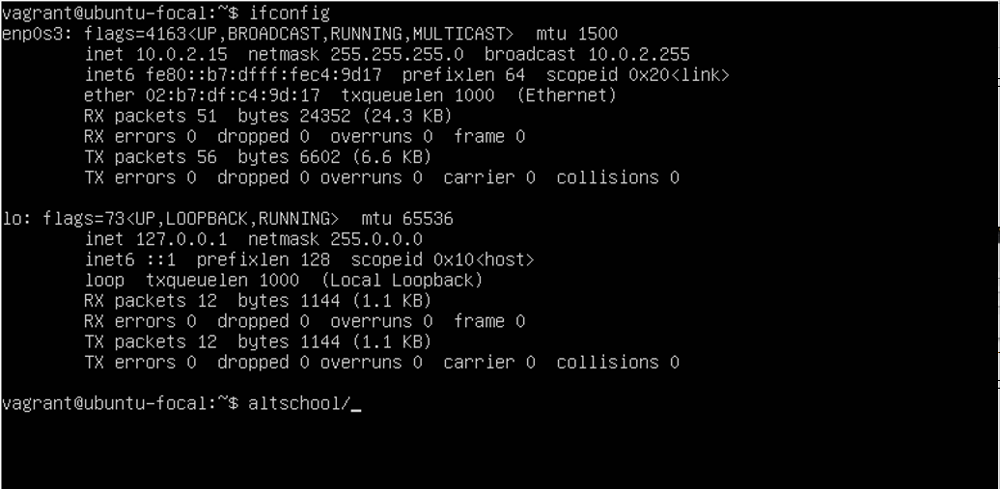

# Task 1
I set up Ubuntu 20.04LTS on my local machine using Vagrant.  
I customised the Vagrantfile with private network set to dhcp.  

  
I ran ``ifconfig`` in the machine, and this is the output of the general Vagrant file. 

